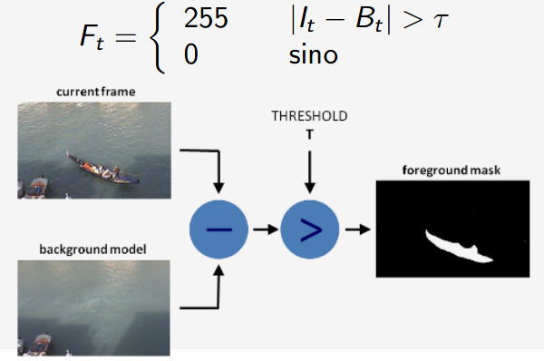

# Resumen C1 PDI en **__MARKDOWN__**

### En proc_basico esta como sacar img, video y como iterar sobre ellos
### en gamma esta la tarea 1 de gamma
___
##Intro

**Pıxel** (picture element):Elemento basico de una imagen digital, que contiene valores **cuantizados** que representan la intensidad (brillo) o el color del pixel.

**Cuantificacion** : restringir valores **continuos** a **discretos**. (Ej: digitalizar una foto)

**Filtro**: Operacion matricial a una img, tb conocido como **kernel**.
___
## Adquisicion y procesamiento basico

* Escala de grises: 1 canal = 8 bpp
* Color: 3 Canales = 24 bpp
* Color + transparencia = 4 Canales = 32 bpp

#### Valores cv::mat
~~~

CV_8U - 8-bit unsigned integers ( 0..255 )

CV_8S - 8-bit signed integers ( -128..127 )

CV_16U - 16-bit unsigned integers ( 0..65535 )

CV_16S - 16-bit signed integers ( -32768..32767 )

CV_32S - 32-bit signed integers ( -2147483648..2147483647 )

CV_32F - 32-bit floating-point numbers ( -FLT_MAX..FLT_MAX, INF, NAN )

CV_64F - 64-bit floating-point numbers ( -DBL_MAX..DBL_MAX, INF, NAN )

~~~
#### MATS
// Crear una matriz compleja de 7x7 con el valor (1+3i).
~~~c++
cv::Mat M(7, 7, CV_32FC2, Scalar(1,3)); 
~~~

#### Espacios de color
* **Brillo**: intensidad del pixel, [0,255]
* **Matiz(hue)**: Longitud de onda predominante en una img
* **Saturacion**: inversamente porporcional a la luz blanca en una img. Ej, un punto blanco tiene saturacion 0, un punto azul tiene saturacion maxima.

##### Conversiones 
* **Cubo rgb**: Clasic old cubo qliao
* **HSI Space**: Hue, saturaton, intensity, **ideal para algoritmos de descripcion de color**, Altura es la intensidad(cuanta luz llega, mientras mas arriba mas brillo), el angulo es el matiz, y el radio es la saturacion  

* **YUV e YIQ**: Recodificacion del RGB, contiene el **luma**, y el plano de colores **croma**, permite compatibilidad entre los tv a colores y los blanco y negro.

####Conversion de color en opencv
~~~c++
cv::cvtColor(Mat src, Mat dst, int code);
~~~
**Codigos de conversion**
~~~c++
cv::COLOR_BGR2RGB    //Convierte entre RGB y BGR (con o sin canal alpha)
cv::COLOR_RGB2BGR
cv::COLOR_RGBA2BGRA
cv::COLOR_BGRA2RGBA
cv::COLOR_RGB2RGBA   //Agrega canal alpha
cv::COLOR_BGR2BGRA
cv::COLOR_RGBA2RGB   //Elimina canal alpha
cv::COLOR_BGRA2BGR
cv::COLOR_RGB2GRAY   //Convierte RGB o BGR a grayscale
cv::COLOR_BGR2GRAY
cv::COLOR_GRAY2RGB   //Convierte grayscale a RGB o BGR
cv::COLOR_GRAY2BGR

cv::COLOR_RGB2YCrCb //Convierte RGB o BGR a YCrCb (YUV)
cv::COLOR_BGR2YCrCb
cv::COLOR_YCrCb2RGB
cv::COLOR_YCrCb2BGR
cv::COLOR_RGB2HSV //Convierte RGB o BGR a HSV (hue saturation value), y vice versa
cv::COLOR_BGR2HSV
cv::COLOR_HSV2RGB
cv::COLOR_HSV2BGR
cv::COLOR_RGB2HLS //Convierte RGB o BGR a HLS (hue lightness saturation), y vice versa
cv::COLOR_BGR2HLS
cv::COLOR_HLS2RGB
cv::COLOR_HLS2BGR
~~~

* **Separacion de canales**:
~~~c++
vector<cv::Mat> bgr_planes;
cv::split( img, bgr_planes );
cv::imshow("Green", bgr_planes[1]);
~~~
* **Mezcla de canales**:
~~~c++
cv::Mat out;
cv::merge(bgr_planes, out);
cv::imshow("Remezclado", out);
~~~
* **Cambio de dimensiones**:
OJO, Size(y,x) - Size(width,height)
~~~c++
cv::Mat dst;
cv::resize(img, dst, cv::Size(img.cols/2, img.rows/2));
~~~
* **operaciones matriciales**: 
~~~c++
cv::Mat dst(480,480,CV_8UC3);
dst = cv::Scalar(0,128,0); //e.g. Imagen verde
dst += 10; //Aumenta todos los canales y pixeles en 10
~~~

#### Correccion gamma

q(x,y) = p(x,y)^Gamma
 Todos los valores de los pixeles deben ser normalizados entre [0,1].
 Mejora los valores de contraste de manera controlada
 **Se recomienda usar una tabla de conversiones por el costo
 que tiene la funcion POW**

____

## Operadores locales y segmentacion

#### Suavizado 
Reduce transiciones fuertes entre pixeles, elimina ruido o suaviza "altos"

#### Filtro promedio simple

~~~c++
cv::boxFilter(InputArray src, OutputArray dst, int ddepth, Size ksize);
~~~
Parametros:
* src - imagen entrada.
* dst - imagen salida (mismo tamaño y tipo que src).
* ddepth - el depth de la imagen de salida (-1 usa src.depth()).
* ksize - Tamaño del filtro.

#### Filtro gaussiano
Filtro **isotropico**, respeta distancia euclideana

~~~c++
void GaussianBlur(InputArray src, OutputArray dst, Size ksize,double sigmaX, double sigmaY=0,int borderType=BORDER_DEFAULT )
~~~
Parametros:
* src - imagen entrada.
* dst - imagen salida (mismo tamañno y tipo que src).
* ksize - Tamañno del filtro (ambos impares positivos).
* sigmaX - Desv. estandar en X.
* sigmaY - Desv. estandar en Y (si 0, igual a sigmaX).
* borderType - Metodo de extrapolacion en bordes.

#### Bordes 
al aplicar filtros, los bordes quedan "con valores vacios", por ende no se puede aplicar valores en los bordes, para ello se usa la extension de bordes (**padding**)

~~~c++
BORDER_REPLICATE:     aaaaaa|abcdefgh|hhhhhhh
BORDER_REFLECT:       fedcba|abcdefgh|hgfedcb
BORDER_REFLECT_101:   gfedcb|abcdefgh|gfedcba
BORDER_DEFAULT     =  BORDER_REFLECT_101
BORDER_WRAP:          cdefgh|abcdefgh|abcdefg
BORDER_CONSTANT:      iiiiii|abcdefgh|iiiiiii
                        con algun ’i’ especificado
~~~

#### Filtro Mediano
Tambien suaviza, es no lineal y no se sesga por outliers. Este calcula la mediana entre los vecinos del pixel.
~~~c++
void medianBlur(InputArray src, OutputArray dst, int ksize);
~~~
Parametros:
* src - imagen entrada.
* dst - imagen salida (mismo tamaño y tipo que src).
* ksize - dimension ventana cuadrada; impar > 1.

___
## Deteccion de bordes

Se obtienen con filtros con aproximaciones discretas de operaciones diferenciales entre pixeles cercanos

#### Sobel

Busca borde en direccion horizontal y vertical, se puede obtener una combinacion de los dos gradientes

~~~c++
void Sobel(InputArray src, OutputArray dst, int ddepth,int dx, int dy, int ksize=3, double scale=1, double delta=0,int borderType=BORDER_DEFAULT )
~~~
Parametros:
* src - imagen entrada.
* dst - imagen salida (mismo tamañno y tipo que src).
* ddepth - depth de imagen de salida
    Si src.depth() = CV_8U, ddepth = -1/CV_16S/CV_32F/CV_64F
    Si ddepth=-1, dst tendr ́a misma depth que src.
* xorder - order de derivada en x.
* yorder - order de derivada en y.
* ksize - dimension ventana cuadrada; impar > 1.
* scale - factor de escala opcional para las derivadas.
* delta - delta opcional a sumar a los resultados.
* borderType - metodo de extrapolacion de borde

**Suma ponderada de dos imagenes**
~~~c++
void addWeighted(InputArray src1, double alpha, InputArray src2,double beta, double gamma, OutputArray dst)
~~~

#### Deteccion de bordes de canny
Detector de bordes re popular pibe
consiste en 5 pasos
1) Filtrado de ruido mediante filtro gaussiano: elimina ruido de la imagen y datos irrelevantes
2) Aplicar metodo de deteccion de bordes: primera aproximacion a los bordes,(bordes gruesos), usualmente se usa sobel
3) Clasificacion de la direccion de los bordes: Se clasificac la direccion en 4 angulos.  
                         [0,45,90,135]

4) Non Maximum suppresor: usado para disminuir los bordes gruesos de sobel

# FALTA TERMINAR CANNY

#### Filtro de Agudizado
Destacar detalles finos y corregir imagenes borrosas
la clave es **Diferenciacion digital**
dos caminos 
* Sumar los detalles (Derivativa) a imagen original.
* Resaltar las diferencias entre imagen original e imagen suavizada
~~~c++
cv::GaussianBlur(img, frame, cv::Size(0, 0), 3);
cv::addWeighted(img, 1.5, frame, -0.5, 0, frame);
~~~
____
## Segmentacion
Particionar una imagen digital en multiples segmentos de interes.

#### Treshholding 
segmentacion binaria, utilizado para extraer objeto de fondo, segmentacion de movimiento.
~~~c++
cv::threshold(src, dst, threshold,max_value, type);
~~~

#### Background substraction

Segmentacion binaria, separa **region de interes** o **weas en movimiento** del fondo, normalmente utilizando video.
Usualmente el fondo es **estatico** o con **movimiento periodico**.
se complica con weas que se mueven harto, como el mar o las ramas de las hojas.

#### Metodo del umbral (tresholding)
Se buscan diferencias entre el frame anterior y el actual, en caso de superar cierto treshhold se aplica la mascara encima.

Posibles mejoras:
* multiples criterios para considerar un pixel como movimiento. Espacios de colores,
* Distintos treshholds por zona
* tracking 
* Consideracion de humbral de histeresis

#### Componentes conectados
Luego de segmentar, se busca agrupar los pixeles conectados
La siguiente funcion etiqueta cada grupo con un valor diferente
~~~c++
int connectedComponents(InputArray image, OutputArray labels,int connectivity=8, int ltype=CV_32S)
~~~

#### Mezcla de gaussianas
